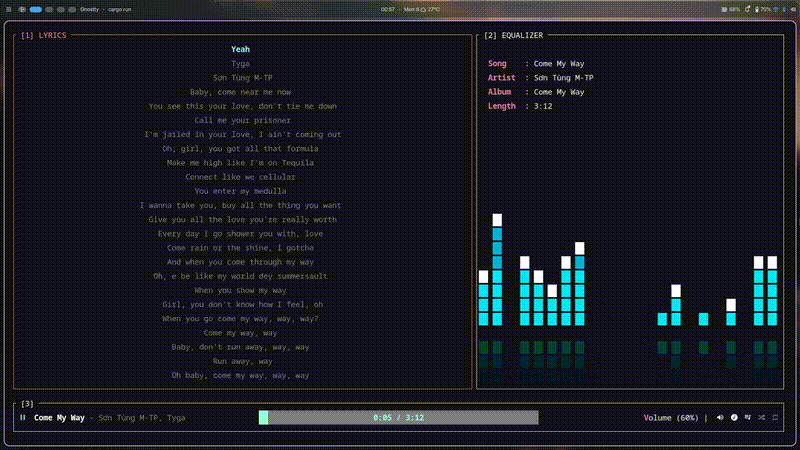

# Spotty

Spotty is a modern terminal user interface for Spotify, built with Rust. It brings playback control, library browsing, search, queue management, device transfer, and lyrics into a keyboard-driven TUI.

Spotty is an unofficial Spotify client and is not affiliated with Spotify AB.

## Demo

<p align="center">
  
</p>

<p align="center">
  🎧 <a href="https://youtu.be/VLUd_-fLCo4">Watch the full demo with audio</a>
</p>

## Features

- Keyboard-first Spotify playback: play, pause, skip, volume, shuffle, and repeat.
- Library access for playlists, liked songs, saved albums, followed artists, and saved podcasts.
- Home view with top tracks, top artists, and recently played tracks.
- Search across tracks, artists, albums, and playlists.
- Queue view with live playback context.
- Device selector for transferring playback between Spotify Connect devices.
- Synced and unsynced lyrics support through Spotify metadata.

## Requirements

- A Spotify Premium account.
- A browser for OAuth authorization.

## Installation

Go to the [Releases page](https://github.com/vquclinh/spotty/releases/tag/v0.0.1) and download the archive for your platform:

| Platform | File |
| --- | --- |
| Linux (x86_64) | `spotty-linux-x86_64.tar.gz` |
| macOS (Apple Silicon) | `spotty-macos-aarch64.tar.gz` |
| Windows (x86_64) | `spotty-windows-x86_64.exe.zip` |

### Linux

Install the ALSA runtime library (required for audio):

```bash
# Debian / Ubuntu
sudo apt install -y libasound2

# Fedora / RHEL
sudo dnf install -y alsa-lib

# Arch
sudo pacman -S alsa-lib
```

Extract and run:

```bash
tar -xzf spotty-linux-x86_64.tar.gz
chmod +x spotty-linux-x86_64
./spotty-linux-x86_64
```

### macOS

macOS includes all required audio libraries. Extract and run:

```bash
tar -xzf spotty-macos-aarch64.tar.gz
chmod +x spotty-macos-aarch64
./spotty-macos-aarch64
```

If macOS blocks the binary because it is from an unidentified developer, remove the quarantine flag:

```bash
xattr -d com.apple.quarantine spotty-macos-aarch64
```

### Windows

No additional dependencies are required. Extract `spotty-windows-x86_64.exe.zip` and run from PowerShell:

```powershell
.\spotty-windows-x86_64.exe
```

If Windows Defender SmartScreen blocks the binary, click **More info → Run anyway**.

### First launch

When you first launch Spotty, it will open your browser and redirect you to Spotify's login page. After logging in, Spotify redirects back to the app automatically. Your credentials are then cached locally, so you won't need to log in again on future launches.

## Keyboard Shortcuts

Use `?` inside Spotty to open the in-app help popup.

### Essential

| Key | Action |
| --- | --- |
| `q` | Quit |
| `?` | Toggle help |
| `g` | Open quick actions |
| `Esc` | Close popup |
| `Enter` | Select or confirm |
| `Tab` | Cycle focus between panels |
| `1` / `2` / `3` / `4` | Focus panel 1 / 2 / 3 / 4 |

### Views

| Key | Action |
| --- | --- |
| `H` | Home |
| `S` | Search |
| `Q` | Queue |
| `L` | Lyrics |

### Playback

| Key | Action |
| --- | --- |
| `Space` | Play or pause |
| `n` | Next track |
| `p` | Previous track |
| `+` / `-` | Increase or decrease volume |
| `s` | Toggle shuffle |
| `r` | Cycle repeat mode |

### Navigation

| Key | Action |
| --- | --- |
| `j` / `Down` | Move down |
| `k` / `Up` | Move up |
| `h` / `Left` | Move left or switch to the previous tab |
| `l` / `Right` | Move right or switch to the next tab |
| `Ctrl+d` | Jump down 10 items |
| `Ctrl+u` | Jump up 10 items |

### Search

| Key | Action |
| --- | --- |
| `Enter` | Run search |
| `Tab` | Cycle result groups: tracks, artists, albums, playlists |
| `Esc` | Return to search input |

### Device Selector

Open quick actions with `g`, then press `t` to transfer playback.

| Key | Action |
| --- | --- |
| `j` / `Down` | Next device |
| `k` / `Up` | Previous device |
| `Enter` | Transfer playback |

## Development

### System dependencies

**Linux (Debian / Ubuntu)**
```bash
sudo apt install -y libasound2-dev pkg-config libssl-dev
```

**Linux (Fedora / RHEL)**
```bash
sudo dnf install -y alsa-lib-devel pkg-config openssl-devel
```

**macOS** — install Xcode Command Line Tools if you haven't already:
```bash
xcode-select --install
```

**Windows** — install [Visual Studio Build Tools](https://visualstudio.microsoft.com/visual-cpp-build-tools/) with the **Desktop development with C++** workload selected.

### Setup

Install Rust from [rustup.rs](https://rustup.rs), then:

```bash
git clone https://github.com/vquclinh/spotty.git
cd spotty
```

### Commands

```bash
cargo run              # run in debug mode
cargo run --release    # run optimized
cargo build --release  # build binary to target/release/spotty
cargo check            # type-check without building
cargo fmt              # format code
cargo clippy           # lint
```

## Tech Stack

| Area | Library |
| --- | --- |
| TUI rendering | [ratatui](https://github.com/ratatui-org/ratatui) |
| Terminal events | [crossterm](https://github.com/crossterm-rs/crossterm) |
| Spotify Web API | [rspotify](https://github.com/ramsayleung/rspotify) |
| Audio playback | [librespot](https://github.com/librespot-org/librespot) |
| Async runtime | [tokio](https://tokio.rs) |

## Project Structure

```text
src/
  app/        Application state, routes, and view models
  audio/      Librespot authentication, player, and audio events
  event/      Event primitives
  handlers/   Keyboard handlers by view
  network/    Spotify API client, requests, and response models
  ui/         Layouts, widgets, popups, and rendering
  lib.rs      Application bootstrap and main event loop
  main.rs     Binary entrypoint
```

## Authors

- Vo Quoc Linh (vquclinh)
- Nguyen Thanh Nhat (night0)

## License

MIT
